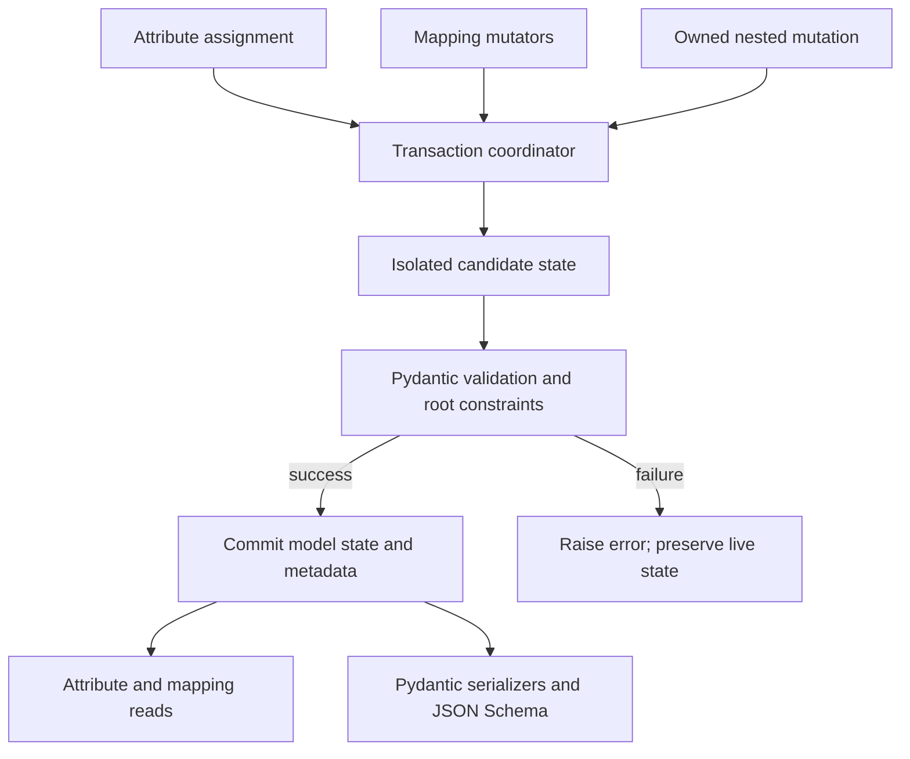

# Architecture and implementation strategy

## One authoritative state

`DictModel` remains a real Pydantic `BaseModel`. Its declared fields and extras
live in Pydantic's model storage. Mapping methods expose that state through an
ordered key space; there is no independently writable backing dictionary.

The [Phase 0.1 prototype](research/prototype-findings.md) implements this design
with private mutable ABC guards and a centralized Pydantic adapter. The sections
below retain the production requirements; prototype decisions and limitations
are distinguished in the findings.

The intended class hierarchy uses `BaseModel` before `MutableMapping[str, object]`.
The runtime experiment in [upstream evidence](research/upstream-behavior.md) checks
only a minimal bridge, not the full mutation design. Avoid a custom metaclass or
core-schema rewrite until a concrete public-API limitation requires it.

## Responsibilities

| Component | Responsibility | Must not do |
| --- | --- | --- |
| Public `DictModel` | Attribute/mapping surface and Pydantic identity | Duplicate model state |
| Key policy | Canonical names, order, extras, namespace restrictions | Apply serializers or resolve output aliases |
| Transaction coordinator | Input staging, candidate validation, commit, rollback boundary | Write live values before success |
| Pydantic adapter | Isolate version-sensitive extraction/commit/hook details | Spread private internals throughout mapping code |
| Ownership layer | Guard nested mutations and notify the owning root | Expose a public typed-collection framework |
| Typing surface | Honest signatures and packaged type information | Hide runtime incompatibility with broad `Any` |

The Phase 0.1 package uses `src/pydandict/__init__.py`, `_core.py`, `_containers.py`
and `py.typed`. The implementation keeps the transaction, compatibility and
ownership mechanisms concentrated while the contracts are hardened; split them
during Phase 0.2 when it improves auditability.

## Transaction engine

Use public Pydantic validation entry points wherever possible. Keep any required
private access in `_compat.py` with version-specific tests. Obtain fields from the
class rather than deprecated instance-level field metadata access.

Candidate extraction uses raw Python values and canonical field names, plus extras.
It must preserve types that serialize differently, including dates, secrets,
nested models, and custom types. Never use `model_dump()` as a lossless state copy:
serializers can transform values, exclude fields, or produce a non-object output.

Candidate validation must accept canonical names internally regardless of external
alias input policy, while preserving that policy for public constructors. Prototype
an explicit `by_name`/`by_alias` validation path on supported versions. Alias
choices and paths must not be flattened into conflicting user-facing keys.

Snapshotting, validation, and preparation can allocate and run user code. Commit
must do neither: prepare all field/extra storage, metadata, ownership handles,
and cache changes before entering the commit step. If committing several storage
slots cannot be made failure-safe, retain the old slots and restore them without
callbacks. Do not claim thread-level atomicity based on the GIL.

The coordinator must reject reentrant public mutation on the same root. Candidate
construction needs an internal phase distinct from ordinary public assignment so
that Pydantic initialization and supported validators do not recursively enter
the transaction engine.

Treat the proposed internal phases as idle, staging, validating, preparing and
committing, with restoration and return to idle on failure. Acquire the same-root
reentrancy guard before consuming user iterables or invoking callbacks, not only
before validation. Reads during preparation see committed state. These are private
engine states, not a public transaction API. G2/G3 must test recovery after each
failure boundary and audit finalizers triggered by disposing of old references;
callback-free commit needs implementation evidence, not an assumption about Python
assignment. Prepare removal results along with ownership and metadata.

## Validator semantics: G2

Pydantic owns validation ordering and error generation. PydanDict must not manually
invoke decorators in a guessed order or validate only individual field adapters
when whole-model checks exist.

Full candidate revalidation is the correctness starting point, but it creates a
critical problem: a normalizer such as `value * 2` may run again on an unchanged
field and alter it. A before validator may also expect an external representation
that is no longer present in stored state. Merely passing the existing model can
skip validation under instance-revalidation settings. These are distinct issues.

The prototype must compare two strategies: validating a fully isolated existing
state with a carefully controlled patch path, and validating a reconstructed raw
candidate. It must demonstrate atomic bulk updates and state preservation before
either is selected. Phase 0.1 selected isolated full-candidate validation within
the explicit validator contract; production qualification remains open.

Proposed initial supported contract: validators are deterministic and safe to
rerun on canonical Python state; normalization is idempotent; after validators
return the candidate instance; validation does not mutate external objects or
private state used by other live models. Pydantic validator forms remain usable
within this contract. Non-idempotent/representation-specific validators need
explicit support evidence or a documented exclusion before release. Do not claim
universal Pydantic validator compatibility while G2 is open.

Construction may accept Pydantic validation context. Mutations use Python mode
and `context=None` in the proposed v1 API; context is not silently captured from
a request and retained for the model lifetime. State invariants must therefore be
checkable without request-scoped context. Context-dependent mutation validation
would need a later explicit API, not hidden ambient state.

## Lifecycle and hooks

Audit constructor, `model_validate*`, nested validation, `model_post_init`, field
and model validators, copy/deepcopy, deprecated methods, frozen configuration,
computed fields, and serialization entry points. Guard installation must happen
on every supported construction path, after schema validation and before the
result escapes. Nested FastAPI/Pydantic construction must not bypass ownership.

`model_post_init` is construction work, not a mutation callback. A candidate
revalidation strategy that reruns it must isolate private state and avoid repeated
side effects; otherwise that hook combination is unsupported until resolved.
Custom `__init__`, custom core schemas, cached properties, and writable properties
need explicit compatibility tests. Reject unsupported setters that could expose
partial updates; do not quietly route arbitrary property setters around the engine.

## Extensibility constraints

Do not expose a plugin interface for custom ownership guards in v1. Add a supported
type only with an inventory of its mutation paths, alias behavior, serializer
behavior, and typing proof. Subclasses that override safety-critical methods are
responsible for preserving the contract; ordinary Python subclassing is not a
sandbox. Keep safety-critical overrides clearly documented and internally audited.

The [nested-values design](nested-values.md) and [compatibility matrix](compatibility.md)
set the limits of the first implementation. Those limits must be settled before
the README changes from “planned” to “supported.”
